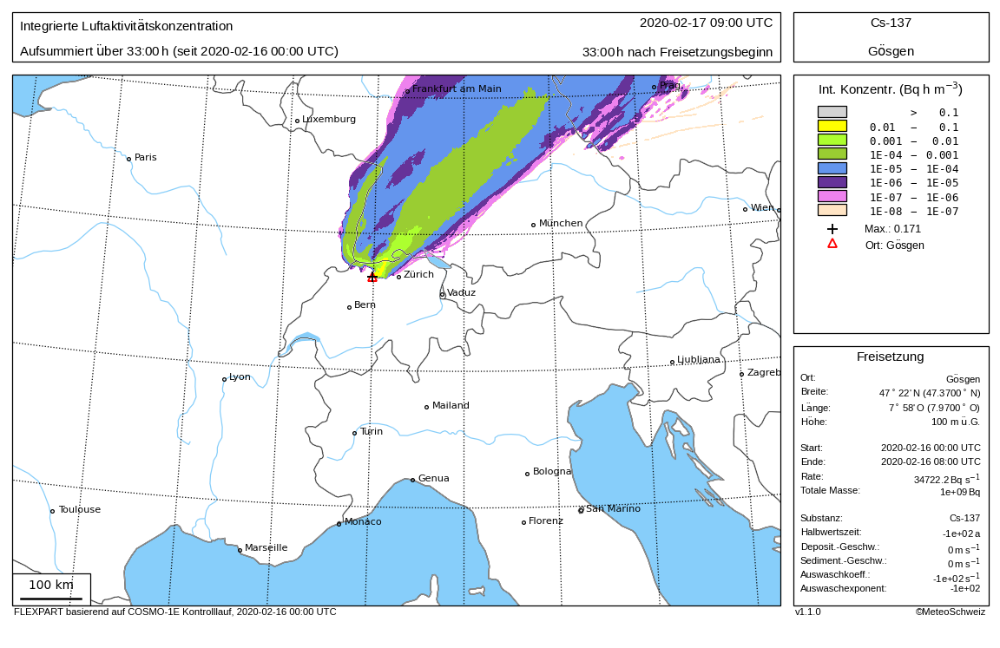

# PyFlexPlot

PyFlexPlot is a Python-based tool to visualize FLEXPART dispersion simulation results stored in NetCDF format.

## Table of Contents

- [Features](#key-features)
- [Installation](#installation)
- [Run pyflexplot](#run-pyflexplot)
  - [Examples](#examples-how-to-run-pyflexplot)
- [Development (CSCS)](#development)
- [External Links](#external-links)
- [License](#license)


## Key Features

### PDF and PNG Files

Pyflexplot allows to visualize data on a map plot and save the output in either PDF or PNG format. To utilize this feature, simply adjust the outfile variable with the appropriate file extension.


### Shape File Generation

Furthermore, Pyflexplot provides the functionality to export data into shape files (.shp) to utilize them in GIS programs such as QGIS 3. The output is a ZIP archive containing the essential components of a shapefile: .shp, .dbf, .shx, .prj, and .shp.xml.
Key aspects of this feature include:

- __Filtering Zero Values__: The tool initially removes zero values from fields (e.g., concentration) before processing.
- __Logarithmic Transformation__: Field values undergo a log_10 transformation to optimize the visualization of data ranges.
- __Precision Handling__: The transformed field values are recorded with 15 decimal places, accommodating the precision limitations of some GIS software.
- __Metadata Storage__: Information, such as details about released materials, are stored within a .shp.xml file as metadata.

### Scaling the field values

Another feature is to manipulate the field values by scaling with an arbitrary factor. This factor can be set in the preset with the variable `multiplier`.

## Installation

You can install pyflexplot from MCH pypi repository using pip:

    pip install pyflexplot -i https://service.meteoswiss.ch/nexus/repository/python-all/simple

## Run pyflexplot

The primary command for pyflexplot follows this structure:

```bash
pyflexplot [OPTIONS] CONFIG_FILE_DIRECTORY
```

To see the available options, run:

 ```bash
 pyflexplot --help
 ```

To use all allocated cpus, add the following option to the pyflexplot command

    --num-procs=$SLURM_CPUS_PER_TASK

If you want to run the following examples interactively,
you may want to allocate parallel resources, e.g. 10 cores

    salloc -c 10

Run `pyflexplot`
Important: Free resources when done!

    exit

### Examples how to run pyflexplot

Example using default input file.
This example assumes you are in the pyflexplot directory.

Default input files are searched for in  `./data`.
Link the default input files if you want to use these for tests.

    ln -s /store/mch/msopr/pyflexplot_testdata data

Create an output directory

    exp=test
    dest=plot_$exp
    mkdir $dest

There are several default config files available under [`src/pyflexplot/data/presets/opr`](src/pyflexplot/data/presets/opr/).
To run the program for all presets that produce the graphics in PDF format, define the `preset` variable as:

    preset='opr/*/all_pdf'

This preset however only works for the default (test) input files.

To produce graphics for a specific FLEXPART output, select the fitting specific preset from the table below and define the `preset` variable accordingly:

| Model                 | Type         | Define Preset Variable             |
|-----------------------|--------------|------------------------------------|
| FLEXPART-IFS          | global       | `preset=opr/ifs-hres/all_pdf`      |
| FLEXPART-IFS          | Europe       | `preset=opr/ifs-hres-eu/all_pdf`   |
| FLEXPART-COSMO-1E-CTRL| deterministic| `preset=opr/cosmo-1e-ctrl/all_pdf` |
| FLEXPART-COSMO-2E-CTRL| deterministic| `preset=opr/cosmo-2e-ctrl/all_pdf` |
| FLEXPART-COSMO-1E     | ensemble     | `preset=opr/cosmo-1e/all_pdf`      |
| FLEXPART-COSMO-2E     | ensemble     | `preset=opr/cosmo-2e/all_pdf`      |
| FLEXPART-ICON-CH1-CTRL| deterministic| `preset=opr/icon-ch1-ctrl/all_pdf` |
| FLEXPART-ICON-CH2-EPS | ensemble     | `preset=opr/icon-ch2-eps/all_pdf`  |

After selecting a preset, run pyflexplot interactively for the default test data:

```bash
pyflexplot --preset "$preset" --merge-pdfs --dest=$dest
```

Alternatively, specify the FLEXPART output file in NetCDF format as input data:

```bash
pyflexplot --preset "$preset" --merge-pdfs --dest=$dest --setup infile <netcdf-file>
```

For ensemble input, the placeholder `{ens_member:03}` may be used within the path of `<netcdf-file>`. Instead of `03` for `%03d`, other formats for the ensemble member field can be used.

Alternatively run as a batch job (recommended)
```bash
batchPP -t 2 -T 10 -n pfp_$exp -- \
  $CONDA_PREFIX/bin/pyflexplot --preset $preset \
  --merge-pdfs --dest=$dest --num-procs=\$SLURM_CPUS_PER_TASK
```


Example using operational Flexpart ensemble output based on COSMO-2E
```bash
exp=test-2e
preset=opr/cosmo-2e/all_pdf
basetime=$(date --utc --date="today 00" +%Y%m%d%H)
infile000=$(echo /store/mch/msopr/osm/COSMO-2E/FCST${basetime:2:2}/${basetime:2:8}_5??/flexpart_c/000/grid_conc_*_BEZ.nc)
infile=${infile000/\/000\//\/\{ens_member:03\}\/}
dest=plot_${basetime:2:8}
mkdir $dest
batchPP -t 1 -T 10 -n pfp-$exp -- \
  $CONDA_PREFIX/bin/pyflexplot --preset $preset \
    --merge-pdfs --setup infile $infile --setup base_time $basetime --dest=$dest \
    --num-procs=\$SLURM_CPUS_PER_TASK
```

The following expamles use FLEXPART output generated with the test-fp script
in the test subdirectory of the flexpart repository of MeteoSwiss. Define FP_JOBS
as path to the FLEXPART output files, e.g.

    FP_JOBS=/scratch/kaufmann/flexpart/job

Write output to a location where you have write access, e.g.

    FP_OUT=$SCRATCH/flexpart/job

After additionally defining preset and exp, create the output directory
and submit a job with

    infile=$(echo $FP_JOBS/$exp/output/*.nc)
    basetime=$(cat $FP_JOBS/$exp/output/plot_info)
    dest=$FP_OUT/$exp/plots
    mkdir -p $dest

and submit the job with the batchPP command as above

Example: FLEXPART with COSMO-2E Control Run

    preset=opr/cosmo-2e-ctrl/all_pdf
    exp=1074

Example: FLEXPART with COSMO-1E Control Run

    preset=opr/cosmo-1e-ctrl/all_pdf
    exp=1076

Example: FLEXPART with COSMO-2E Ensemble Run.
For ensembles, the infile needs to be a pattern rather than a single file

    preset=opr/cosmo-2e/all_pdf
    exp=short-bug
    infile000=$(echo $FP_JOBS/$exp/output/000/*.nc)
    infile=${infile000/\/000\//\/\{ens_member:03\}\/}

Example: New test case with cloud crossing dateline from both sides

    exp=test
    preset=opr/ifs-hres/all_pdf
    infile=data/ifs-hres/grid_conc_20220406180000_Chmelnyzkyj.nc
    basetime=2022040612
    dest=plot_$exp
    mkdir $dest

submit job with batchPP command above

After job completion, list and visualize results with

    ls $dest/*pdf
    evince $dest/*pdf

### Running Pyflexplot with S3 input (and output)

In order to download input NETCDF data from S3, and S3 URI can be specified as the setup parameter `infile` as below:

```bash
pyflexplot --preset "$preset" --merge-pdfs --dest=$dest --setup infile s3://<s3-bucket-name>/flexpart_cosmo-2e_2021030503_{ens_member:03d}_MUE.nc
```

In order to output the resulting plots to an S3 bucket, specify the S3 bucket name as the `--dest`. The plots will still be created locally at the dest dir path defined in the config/settings.yaml

```bash
pyflexplot --preset "$preset" --merge-pdfs --dest=s3://<s3-bucket-name>
```

## Development

__Prerequisites__: Git, [Poetry](https://python-poetry.org/docs/#installing-with-the-official-installer)

### Install dependencies & start the service locally (CSCS)

Clone the repo and enter the project folder:
```bash
git clone git@github.com:MeteoSwiss-APN/pyflexplot.git && cd pyflexplot
```

Configure Poetry to not create a new virtual environment. If it detects an already enabled virtual (eg Conda) environment it will install dependencies into it:
```bash
poetry config --local virtualenvs.create false
```

Create an Conda (or mamba/micomamba) environment with only desired Python version and activate:
```bash
conda create --prefix ./.conda-env python=3.10
conda activate ./.conda-env
```

Go into the pyproject.toml and replace `hub.meteoswiss.ch` with `service.meteoswiss.ch`. (This is required because we are external to MCH at CSCS. This modification is a temporary measure until the URLs for Nexus are unified). 
```bash
poetry lock --no-update
```
Do not commit your modified poetry.lock and pyproject.toml with these changes, as the CICD pipeline needs them as they were originally. 

Install packages
```bash
poetry install
```

### Run the tests and quality tools

Run tests
```bash
poetry run pytest
```

Run pylint
```bash
poetry run pylint
```

Run mypy
```bash
poetry run mypy
```

### Updating the Test References

Pyflexplot includes a set of functionality tests that compare generated output against predefined reference data.
These reference files, which contain summary dicts, are stored as tests/slow/pyflexplot/test_plots/ref_*.py files.
To update these reference files, uncomment the following line towards the end of the test file  [`tests/slow/test_pyflexplot/test_plots/shared.py`](tests/slow/test_pyflexplot/test_plots/shared.py):

       _TestBase = _TestCreateReference

Then re-run the (slow) tests to generate the new reference files. After generating the new reference files, comment out the above line again as it was before or simply revert the file with git.

## External Links

- [pyshp](https://github.com/GeospatialPython/pyshp) - Python module to generate Shapefiles

## License

This project is licensed under the terms of the MeteoSwiss. The full license text can be found in the [LICENSE](LICENSE) file.
In essence, you are free to use, modify, and distribute the software, provided the associated copyright notice and disclaimers are included.
